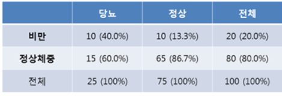

```{r setup, include=FALSE}
knitr::opts_chunk$set(echo = TRUE)
library(tidyverse)
library(plotly)
library(regclass)
library(DT)
```
class: inverse

## 목차

## 1. 차원 축소란?

## 2. PCA(;Principal Components Analysis)

## 3. FA(;Factor Analysis)

## 4. Other Technique

---
class: inverse
#### 1. 차원 축소란?

## 차원 축소란?

### - **기술적 처리를 수월케**하고 **수학적 난점을 해결**하기 위해 데이터를 압축하는 것

### - 정보 손실을 최소화 하면서 데이터의 크기를 줄이는 것이 목표

### - 빅데이터 시대에 필수적인 기술!

---
class: inverse
#### 1. 차원 축소란?

## A. 빅데이터의 문제점

### a. 막대한 연산량
### b. 추정 대상의 증가
### c. N << P의 문제
### d. 차원의 저주

---
class: inverse
#### 1. 차원 축소란?

## a. 막대한 연산량

### - 많은 알고리즘이 데이터/피쳐가 늘어남에 따라 연산량이 기하적으로 늘어남


## b. 추정 신뢰도의 감소

### - 샘플 개수는 그대로 인데 추정 대상 수가 늘어남 
### - 개별 피쳐 관련 모수의 추정 신뢰도가 낮아짐. (자유도의 문제)


---
class: inverse
#### 1. 차원 축소란?

## c. N << P의 문제

### - 샘플의 개수가 피쳐의 수보다 훨씬 적은 경우  통계적 기법 적용이 불가

### ex) 
### 정밀공정을 가진 첨단 제품의 불량율 분석
###  우주선 발사의 실패 요인 분석 

---
class: inverse
#### 1. 차원 축소란?

## d. 차원의 저주

### - 차원이 늘어감에 따라 발생하는 여러 부정적인 현상의 총칭

###  - 사실 위의 문제들을 모두 포함하는 말

###  - 모든 샘플들이 아웃라이어화가 됨

###  - 데이터가 비어있거나 없는 것들이 늘어나 sparse 데이터를 만들어 낼 수 있음

---
class: inverse
#### 1. 차원 축소란?

## B. 차원 축소의 기본 전략
### - 불 필요한 변수는 지우고 중요한 변수를 남기자
<br>
### **a.변수 선택** 
### 변수 형태를 살리면서 중요한 변수만을 살리는것
### **b.변수 추출**
### 변수를 변형하여 새로운 변수를 추출해내는 것

---
class: inverse
#### 1. 차원 축소란?

## C. Factorization

- ### 데이터 프레임: 데이터가 직사각형 모양의 행렬 꼴로 저장되어 있는 데이터 저장 양식

- ### Factor: 여러 피쳐들 속에서 대표성을 띌 수 있는 잠재적 요인을 의미 

- ### Factorization은 Factor들을 찾아내는 기법

- ### 철학에 따라 PCA, MCA, NMF, ICA 등이 있음

---
class: inverse
#### 2. PCA(;Principal Components Analysis)

## PCA(;Principal Components Analysis)란?

### A. SLC(;Standard Linear Conbination)의 일종

### B. 철학: 분산이 큰 변수가 정보를 많이 가진 변수!

### C. 선형적 정보를 보존할 수 있는 기법

### D. 결과물 축이 선형 독립

---
class: inverse
#### 2. PCA(;Principal Components Analysis)

## A.SLC(;Standard Linear Conbination)

### 선형 조합만을 이용해 새로운 변수를 만드는것

<br>

### $\textbf{z}=\delta^t \textbf{X} = \delta_1 \textbf{x}_1 + \delta_2 \textbf{x}_2 +... +\delta_p \textbf{x}_p$ 

### such that $\delta^t\delta = \mid \delta \mid=1$

---
class: inverse
#### 2. PCA(;Principal Components Analysis)

###  B. 철학: 분산이 큰 변수가 정보를 많이 가진 변수!

### 갑자기 철학?
### ->모든 머신러닝 기법에는 주관성과 철학이 있다

### PCA에서는 분산 = 정보량이라고 본다!

### ex) 학생의 남/녀 에 대한 정보 보다는 키,학점 등의 정보가 표본간 구분을 더 잘 지어주는 정보

---
class: inverse
#### 2. PCA(;Principal Components Analysis)


##  C. 결과물 축이 선형 독립

### 분산을 가장 잘 보존하는 축은 아이젠 벡터이다.
<br>
### 왜?
### $max(Var(z))=max(\delta^t \Sigma \delta) = \lambda_1$ 
### (; $\lambda_1$은 $\Sigma$의 아이젠 밸류 중 가장 큰 값)
### (; 이때 $\delta$는 $\lambda$에 연계되는 아이젠 백터)
---
class: inverse
#### 2. PCA(;Principal Components Analysis)
<br>
### $max(Var(z))=max(\delta^t \Sigma \delta) = \lambda_1$ 
<br>
### pf1) 
### $L = \delta^T \Sigma \delta - \lambda(\delta^T \delta -1)$  
### $\frac{dL}{d \delta} = 2\Sigma\delta - 2\lambda\delta =0$       
### $\Sigma\delta = \lambda \delta$ (Eigen Value의 정의)

---
class: inverse
#### 2. PCA(;Principal Components Analysis)
<br>
### $max(Var(z))=max(\delta^t \Sigma \delta) = \lambda_1$ 
<br>
### pf2) Quadradic Form Theorem 이용
### $max(\frac{\delta^T A \delta }{\delta^T B \delta}) = \lambda_1$
( $\lambda_1$은 $B^{-1}A$의 아이젠 밸류 중 가장 큰값)
### $A= \Sigma, B = I$로 둘 시 유도 가능

---
class: inverse
#### 2. PCA(;Principal Components Analysis)

### PCA의 결과물은 공분산 행렬을 Spectral Decomposition(Eigen Value Decomposition) 한것
<br>
### 왜?
### 선형정보를 가장 많이 담은 $\delta_1$ 축
### $\delta_1$축과 선형 독립이면서 많은 정보를 담은 축
### -> $\delta_2$ 축

---
```{r echo=FALSE}
x1 <- scale(rnorm(1000,0,1))
x2 <- scale(3*x1 + rnorm(1000,0,abs(2-abs(x1))))
y <- 0.7*x1 + 0.3*x2+ rnorm(1000,0,1)
```


```{r fig.width=10, fig.height=7}
data = data.frame(cbind(x1,x2,y))
colnames(data) = c("x1","x2","y")
data %>% ggplot(aes(x=x1,y=x2)) +geom_point()
```

---
```{r fig.width=10, fig.height=7}
plot_ly(data ,x=~x1, y=~x2, z=~y, type="scatter3d", mode = 'markers',size=0.1,color=~y)
```

---
```{r}
lr1 = lm(y~x1+x2,data); summary(lr1)
```

```{r}
VIF(lr1)
```
---
```{r}
pca = prcomp(data[,1:2])
summary(pca)
```

```{r}
pca$rotation
```

---
```{r warning=FALSE}
data %>%
  ggplot(aes(x=x1,y=x2))+xlim(c(-3.5,3.5))+ylim(c(-2.5,2.5)) + geom_point() +  geom_abline(intercept=0,slope=pca$rotation[2,1]/pca$rotation[1,1])+geom_abline(intercept=0,slope=pca$rotation[2,2]/pca$rotation[1,2])
```
---

```{r fig.width=10, fig.height=7}
data.frame(pca$x) %>%
  ggplot(aes(x=PC1,y=PC2)) + geom_point()
```

---
class: inverse
#### 2. PCA(;Principal Components Analysis)

## PCA의 특징

### - 비지도 학습이다.
### - 스케일링에 민감하다.
### - 아웃라이어에 민감하다.
### - 연속형 자료에서만 사용가능하다. 
### - 축들의 이름이 사라진다.
 
---
class: inverse
### 3. Factor Analysis


## Factor Analysis란?
### -행렬분해를 통해 얻어낸 팩터들을 분석함으로써 통계적인 설명을 가미하는 것을 의미


### - PCA의 경우, PC Loading Matrix를 쓰는 것이 일반적

### - PC Loading Matrix - 결과물 축과 원본 축의 상관계수
 
---
### 3. Factor Analysis

## mtcars 데이터
```{r echo=FALSE}
data(mtcars)
knitr::kable(mtcars[1:10,1:8],format="html")
```
 
---
### 3. Factor Analysis
## PCA 성능 확인
```{r}
pca2=prcomp(mtcars)
summary(pca2)
```
### - 분산 보존율으로 전체에서 PC별로 설명력 비중을 알아볼 수 있음

---
### 3. Factor Analysis

## PC loading Matrix
```{r}
pca2$rotation[,1:4]
```

### - 기존 변수와 만들어진 변수의 상관계수 행렬
---
### 3. Factor Analysis

### a.PC1의 경우, disp,hp와 높은 양의 상관관계를 가짐
- ### disp: 배기량, HP: 마력 

### -> PC1의 경우 자동차의 힘이라고 해석 가능

### b.PC2의 경우,disp와는 양,hp와는 음의 상관관계를 가짐
### -> 배기량이 포착하지 못하는 힘이라고 해석가능


---
class: inverse
#### 4. Other Technique

## A.MCA(Multiple Correspondence Analysis)

### - 범주형 자료에서 사용하는 기법

### - 철학: 카이제곱 거리가 큰 변수들은 서로 연관성이 큰 것이다!

### - 범주형 자료를 연속형 자료로 임베딩 할때 사용할 수 도 있다.

---
class: inverse
#### 4-A. MCA(Multiple Correspondence Analysis)

### 카이제곱 검정이란?
### 두 변수의 독립성에 대한검정
### ex) H0 : 비만과 당뇨는 무관하다(독립이다)
  
#### $X^2 = \sum\frac{(obs-exp)^2}{exp}$
0 일수록 독립, 클수록 연관

---
class: inverse
#### 4-A. MCA(Multiple Correspondence Analysis)

## PCA의 컨셉
### PCA는 공분산 행렬을 Spectral Decomposition 한 것
### 공분산이 클수록 공유 정보가 많다
<br>
## MCA의 컨셉
### MCA는 카이제곱행렬을 Spectral Decomposition 한 것
### 카이제곱통계량이 클수록 공유정보가 많다

---
#### 4-A. MCA(Multiple Correspondence Analysis)
```{r}
library(FactoMineR)
poison = read.csv("mushrooms.csv")
knitr::kable(head(poison),format="html")
```

---
#### 4-A. MCA(Multiple Correspondence Analysis)
```{r echo=FALSE, fig.width=10, fig.height=7}
library(FactoMineR)
poison = read.csv("mushrooms.csv")
x_dt = poison[,2:23]
res.mca <- MCA(x_dt,
              graph=FALSE)
result = data.frame(cbind(poison[,1],scale(res.mca$ind$coord[,1:3])))
plot_ly(result,x=~Dim.1, y=~Dim.2, z=~Dim.3, type="scatter3d", mode = 'markers',size=0.1,color=~V1)
```

---
class: inverse
#### 4. Other Technique

## B. NMF(Non-Negative Matrix Factorization)

### - $A \approx BC$에 대해 행렬 A,B,C 모두 양수를 원소로 가지는 것

### - $A \sim BC$ 간의 거리를 최소화 시키는 방식으로 행렬분해

### - 결과물이 해석에 용이하게 변함

### - 생체신호, 계량 화학 등에서 유용하게 사용 
---
class: inverse
#### 4. Other Technique

## C. ICA(Independent Components Analysis)

### - PCA가 선형적 독립을 찾는 것이라면 ICA는 통계적 독립을 찾는 것

### - 영상 신호 분석, 소리 분해 등에 사용

### - HGmin1159.github.io 참고
