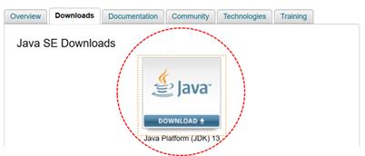
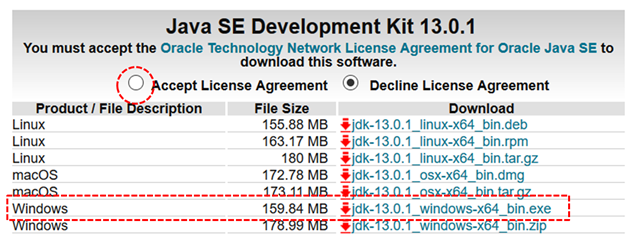
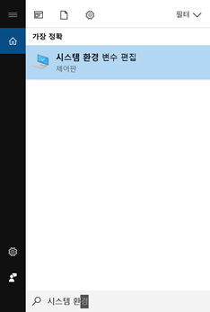
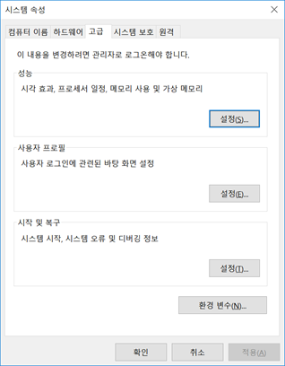
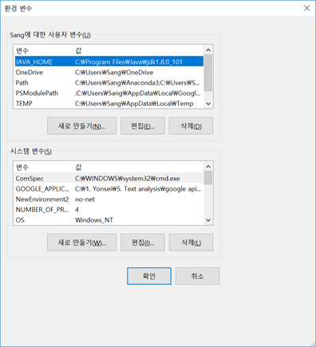
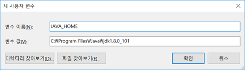
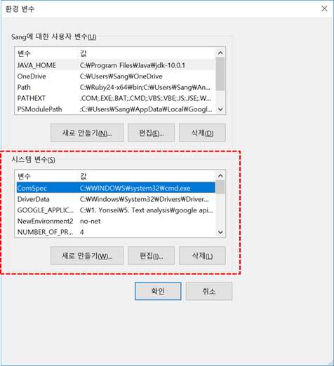

# KoNLPy 설치 방법

파이썬에서 한글 텍스트의 분석은 [`KoNLPy`]((http://konlpy.org/en/latest/)) 코엔엘파이라고 읽음 모듈을 통해서 할 수 있다. `KoNLPy`는 Java로 개발된 형태소 분석기를 기본으로 하기 때문에 `KoNLPy`를 사용하기 위해서는 필요한 Java 프로그램을 미리 설치해야 한다.<sup>1</sup>

## 1) JDK 설치하기 

http://www.oracle.com/technetwork/java/javase/downloads/index.html

아래와 같은 화면에서 빨간 원 안의 아이콘을 클릭한다.
 


클릭하면 나오는 아래 화면에서 Accept 버튼을 체크한다. 


 
위와 같이 윈도우를 사용하는 경우는 윈도우 파일 (jdk-13.0.1_windows-x64_bin.exe)을 선택하여 다운로드 받고, 실행시킨다. 현재 버전은 다를 수 있습니다. 

### 시스템 환경 변수 설정하기

설치한 다음에는 시스템 환경 변수 설정에서 JAVA_HOME이라는 변수를 해당 jdk 파일이 있는 폴더의 경로로 설정해 주어야 한다. 이를 위해서는 일단 위도우 화면 왼쪽 하단에 있는 돋보기 (검색) 버튼을 클릭하여 아래 그림과 같이 ‘시스템 환경 변수 편집’ 아이콘을 찾는다. 



찾은 후 이를 클릭하면,  아래와 같은 창이 실행된다. 여기에서 오른쪽 하단 부분에 있는 ‘환경변수’ 버튼을 클릭한다. 



해당 버튼을 클릭하면 아래와 같은 화면이 나온다.  환경 변수에는 크게 두가지 종류가 있다. 하나는 사용자 변수이고 다른 하나는 시스템 변수이다. 이중에 우리가 추가해야 하는 것은 사용자 변수이다. 이를 위해서 사용자 변수 부분에서의 ‘새로 만들기’ 버튼을 클릭한다. 그리고 JAVA_HOME이라는 새로운 변수를 추가한다. 여러분 컴퓨터에서는 아직 JAVA_HOME이라는 변수가 아직 없을 것이다.


 
‘새로 만들기’ 버튼을 클릭하면 아래와 같은 창이 나올 것이다. 여기에 아래와 같이 JAVA_HOME이라는 변수를 추가한다. 이에 해당하는 값은 여러분이 지금 설치한 jdk파일이 위치하는 폴더의 경로이다. 이 경로는 여러분들이 설치한 파일과 환경에 따라서 달라지므로 이를 확인후에 그 값을 입력하면 된다. 
 


입력한 후에 ‘확인’ 버튼을 클릭한다. 나머지 창에서도 ‘확인’ 버튼을  클릭하여 환경 변수 추가를 완료한다. 

### 시스템 변수에도 같은 이름의 변수 생성

이번에는 JAVA_HOME이라는 변수를 사용자 변수가 아니라 시스템 변수로 새롭게 생성하겠습니다. 
아래 그림에서 이번에는 시스템 변수에 대해서 JAVA_HOME 이라는 이름의 변수를 생성하면 됩니다. 방법은 앞에서 했던 것과 동일합니다.
 

 

## 2) JPype 설치하기

JDK를 설치하고 난 후에는 JPype을 설치해야 한다. 설치에 필요한 파일은 http://www.lfd.uci.edu/~gohlke/pythonlibs/#jpype 에서 다운로드 받을 수 있다. 여러분들이 설치한 파이썬 버전에 맞는 JPype 버전을 다운로드 받은 후 설치하면 된다. 파이썬 버전 아래 그림과 같이 확인할 수 있다 . 파이썬 버전이 3.7인 경우 그리고 윈도우 시스템이 64bit 인 경우에는JPype1‑0.7.1‑cp37‑cp37m‑win_amd64.whl파일을 다운 받는다. 이때 다운로드 받는 폴더를 기억한다. 해당 파일을 특정 폴더로 다운로드 받은 다음, cmd (명령프롬프트창)에서 해당 폴더로 이동후 아래 명령어를 통해서 JPype을 설치하면 된다.

```
pip install JPype1-0.6.3-cp36-cp36m-win_amd64.whl
```

이를 위해 pip 명령어를 update해야할 필요가 있을지도 모른다 

```
python -m pip install --upgrade pip
```

## 3) KoNLPy 설치하기
JDK와 JPype이 설치 되었다면, cmd에서 다음 명령어를 통해서 KoNLPy를 설치한다. 

```
pip install konlpy
```

KoNLPy에서는 5개의 형태소 분석기를 제공하고 있다.<sup>2</sup>  각 형태소 분석기 마다 서로 다른 알고리즘 방식과 말뭉치 사전을 사용하므로 어떤 형태소 분석기를 사용하느냐에 따라서 그 결과가 달라질 수 있다. 형태소 분석기 마다 품사의 이름도 조금씩 상이하다. <sup>3</sup>


---

### Tip!! (이는 KoNLPy 설치와는 관계가 없음)

KoNLPy성공적으로 설치한 후,  사용하다 보면 간혹 jvm 관련된 에러가 발생하는 경우가 있다. 이를 해결하기 위해서는 아래와 같은 조치를 취해야 한다. `_jvmfinder.py` 파일에서 `java_home` 변수의 값 변경하여 문제를 해결할 수 있다. 아래와 같이 `_get_from_java_home` 함수의 내용을 변경해 준다. 이때 본인의 컴퓨터의 jdk파일의 경로를 적어주면 된다. 

```python
    def _get_from_java_home(self):
        """
        Retrieves the Java library path according to the JAVA_HOME environment
        variable

        :return: The path to the JVM library, or None
        """
        # Get the environment variable
        #java_home = os.getenv("JAVA_HOME")
        java_home = "C:\\Program Files\\Java\\jdk1.8.0_101"
        if java_home and os.path.exists(java_home):
            # Get the real installation path
            java_home = os.path.realpath(java_home)

            # Look for the library file
            return self.find_libjvm(java_home)
```

---

<sup>1 설치 방법에 대한 추가 정보는http://konlpy.org/en/latest/install/  참조</sup>

<sup>2 http://konlpy.org/ko/latest/morph/  참조</sup>

<sup>3 https://docs.google.com/spreadsheets/d/1OGAjUvalBuX-oZvZ_-9tEfYD2gQe7hTGsgUpiiBSXI8/edit#gid=0 참조</sup>